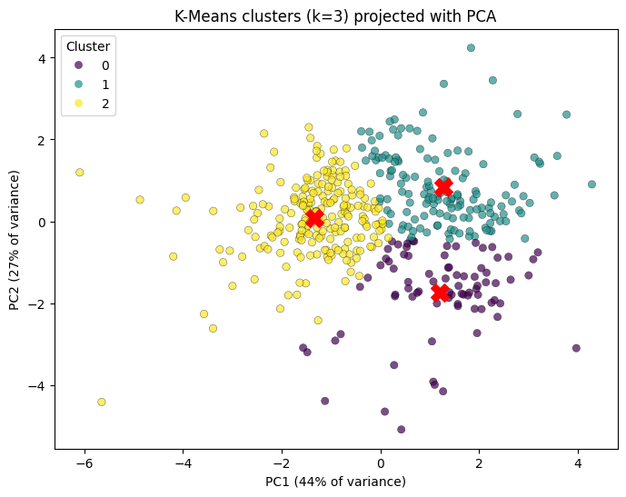
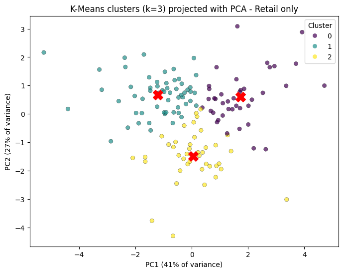

# Wholesale Customer Segmentation with K-Means

Customer segmentation of wholesale clients using K-means clustering, PCA and a two-stage approach (Horeca vs. Retail), built in Python on the UCI Wholesale Customers dataset.

> **About this project:** this is a practice project to refresh and strengthen my machine learning skills. I built it with the help of an AI assistant (Claude by Anthropic), which I used as a tutor and reviewer: to suggest the dataset, explain concepts, and give feedback on my notebook. I wrote and ran the analysis myself.

[Open in Colab](https://colab.research.google.com/github/laritsuda/customer_segmentation/blob/main/Customer_segmentation_of_Wholesale_clients_with_K_means.ipynb)

## Objective
Segment wholesale clients by their purchasing behaviour, and suggest actions for the business and marketing teams. K-means is an unsupervised method, so there is no outcome to predict. The algorithm looks for patterns in the data on its own.

## Dataset
[UCI Wholesale Customers](https://archive.ics.uci.edu/dataset/292/wholesale+customers): 440 clients, with annual spending (in monetary units) in six categories (Fresh, Milk, Grocery, Frozen, Detergents_Paper, Delicassen) and their sales channel (Horeca or Retail). The data has no missing values, so the focus is on the clustering itself and not on data cleaning.

## Approach
1. **Preprocessing:** drop `Channel` from the features, apply a log transform to reduce the skew in spending, and standardize.
2. **Choosing k:** elbow method and silhouette score.
3. **Model on all clients:** K-means with k = 3, visualized with PCA (71% of the variance in 2 components) and checked against the known `Channel` label.
4. **Second stage, Retail only:** the first model separated Horeca clearly but mixed the Retail clients, so I clustered the Retail clients separately (k = 3).
5. **Evaluation:** silhouette, Davies-Bouldin, Calinski-Harabasz, Adjusted Rand Index, and a stability check with different random seeds.

## Results
These are the resulting PCA images:

The final segmentation has four customer segments:
| Segment | Clients | Profile (relative to the Retail average) |
|---|---|---|
| Horeca | 298 | Hotels, restaurants and cafés, defined by the `Channel` label |
| Retail A | 40 | Big-basket packaged buyers (milk, grocery and detergents about 1.7 to 1.9 times the Retail average) |
| Retail B | 59 | Fresh-leaning retailers (fresh and frozen above average, packaged goods low) |
| Retail C | 43 | Dry-goods-only retailers (almost no fresh or frozen) |

**Key findings**
- On all clients, K-means recovered one clear Horeca cluster (99% Horeca) and two mixed clusters.
- Inside the Retail channel, three distinct purchasing profiles appear, and they are stable across random seeds (Adjusted Rand Index of 0.978 or higher).
- The segments are weakly separated (silhouette about 0.25). They describe regions of a continuum and not sharp groups.

## Limitations
- Weak cluster separation (silhouette about 0.25 for both models).
- The Retail subgroup is small (142 clients).
- In the model on all clients, the Horeca cluster holds only 210 of the 298 Horeca clients, so the final "Horeca" segment comes from the `Channel` label and not from the model.
- The suggested business actions in the notebook are hypotheses. The dataset has no price, margin or price-sensitivity data, so they can't be tested here.

## How to run
1. Clone this repository, or open the notebook in Colab with the badge above.
2. Run the notebook top to bottom. The data is downloaded automatically with the `ucimlrepo` package.

## Repository contents
- `Customer_segmentation_of_Wholesale_clients_with_K_means.ipynb`: the full analysis

## Data citation
Cardoso, M. (2013). *Wholesale customers* [Dataset]. UCI Machine Learning Repository. https://doi.org/10.24432/C5030X
